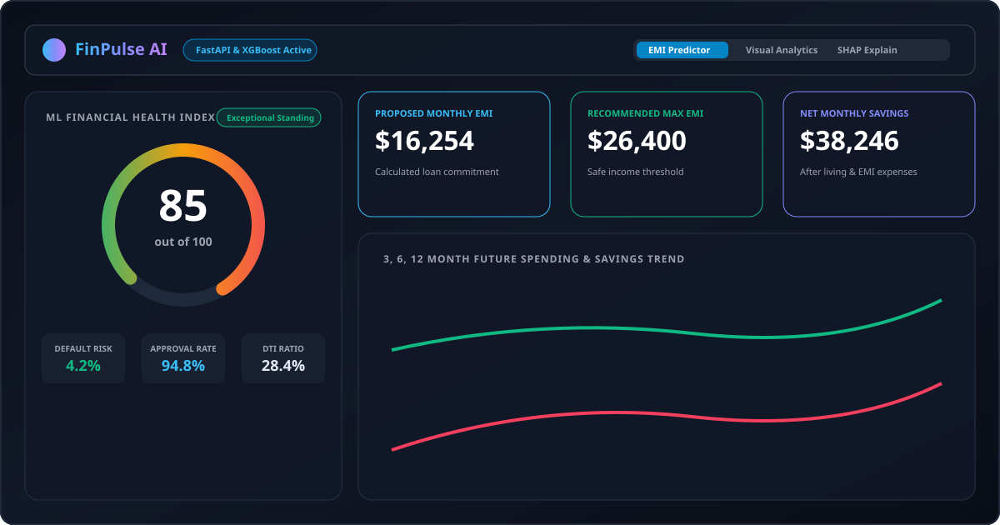
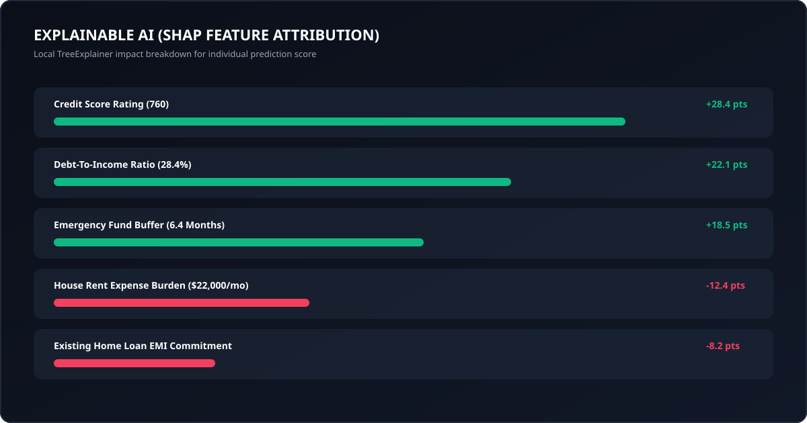
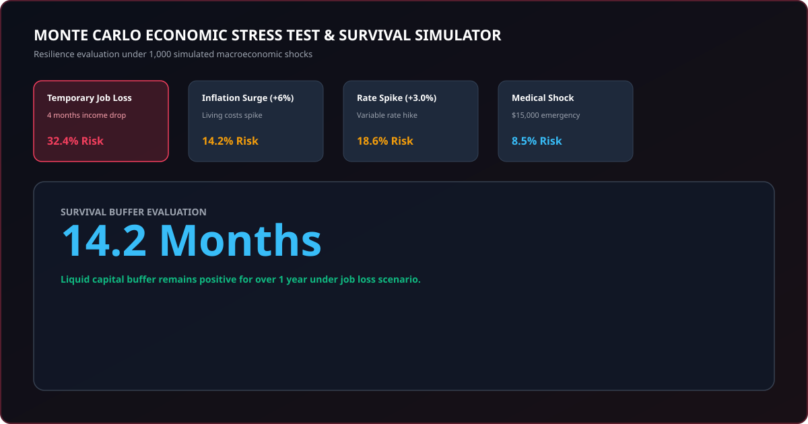

# FinPulse AI: Financial Health, EMI & Repayment Risk Predictor

[](https://github.com/vijaymahes9080/AI-Based-EMI-Prediction/)
[](https://opensource.org/licenses/MIT)
[](https://github.com/vijaymahes9080/AI-Based-EMI-Prediction/actions)
[](https://vijaymahes9080.github.io/AI-Based-EMI-Prediction/)
[](https://www.python.org/)
[](https://fastapi.tiangolo.com/)
[](https://reactjs.org/)
[](https://xgboost.readthedocs.io/)

🚀 **Live Interactive Demo**: [https://vijaymahes9080.github.io/AI-Based-EMI-Prediction/](https://vijaymahes9080.github.io/AI-Based-EMI-Prediction/)

**FinPulse AI** is a production-ready, full-stack Machine Learning application built using **FastAPI**, **React + TypeScript**, **Tailwind CSS**, **Chart.js**, and an ensemble suite of ML algorithms (**XGBoost**, **LightGBM**, **CatBoost**, **Random Forest**, **Scikit-Learn**).

---

## 📸 Application Visual Dashboards & Screenshots

### 1. Main Financial Health & EMI Risk Predictor Dashboard


---

### 2. Explainable AI (SHAP Local Feature Attribution Visualizer)


---

### 3. Monte Carlo Economic Stress Test & Survival Simulator


---

## 📌 Table of Contents
- [Key Features](#-key-features)
- [System Architecture](#-system-architecture)
- [Machine Learning Suite](#-machine-learning-suite)
- [Quick Start Guide](#-quick-start-guide)
- [CI/CD & GitHub Agents](#-cicd--github-agents)
- [License & Author](#-license--author)

---

## 🔥 Key Features

1. **Intelligent EMI & Financial Risk Prediction**:
   - Predicts Monthly EMI Affordability, Max Safe EMI Limit, Net Savings, Debt-to-Income (DTI) Ratio, Loan Approval Probability, and EMI Default Risk.
2. **Real-time Model Reactivity**:
   - Model recalculates predictions, SHAP attributions, and health scores dynamically on every input change.
3. **AI Voice & Conversational Assistant ("FinBot")**:
   - Web Speech API voice widget allowing natural language queries regarding health scores, safe EMI limits, and risk drivers.
4. **Monte Carlo Macroeconomic Stress Tester**:
   - Simulates 1,000 future economic scenarios (Job loss, Inflation surge +6%, Interest rate hikes, Medical emergency shocks) and calculates liquid capital survival buffer in months.
5. **AI Debt Consolidation & Interest Optimization Engine**:
   - Compares **Debt Snowball** vs. **Debt Avalanche** payoff strategies and calculates single low-rate refinancing savings.
6. **Multi-Currency & Living Benchmark Switcher**:
   - Real-time currency selector supporting **USD ($)**, **INR (₹)**, **EUR (€)**, **GBP (£)**, **CAD (CA$)**, **AUD (A$)**, and **JPY (¥)**.
7. **Printable AI Financial Audit Report & Certificate**:
   - One-click official PDF/printable audit certificate complete with digital verification stamp and executive risk verdict.
8. **Explainable AI (SHAP Integration)**:
   - Quantifies exact positive and negative feature contributions driving individual predictions.
9. **Interactive "What-If" Scenario Simulator**:
   - Live sliders to modify housing rent, tenure, or credit score with real-time recalculations.
10. **Visual Analytics Dashboard**:
   - Category expense doughnut chart, income vs. debt obligations bar graph, 3/6/12-month spending trends line chart, and credit score risk curves.

---

## 🏗 System Architecture

```
d:\current project
├── backend/
│   ├── app/
│   │   ├── api/          # FastAPI REST endpoints
│   │   ├── core/         # JWT Security & Config settings
│   │   ├── db/           # SQLAlchemy SQLite Models & Sessions
│   │   ├── ml/           # Data Generator, Preprocessor, Trainer, Explainer, Recommender
│   │   └── schemas/      # Pydantic Input/Output Schemas
│   ├── data/             # Synthetic Financial Dataset
│   ├── models/           # Exported Joblib Trained Model Artifacts
│   ├── tests/            # Pytest test suite
│   ├── requirements.txt  # Python ML dependencies
│   └── run.py            # Backend Server Launcher
├── docs/                 # Postman Collections, OpenAPI & Mermaid Diagrams
│   └── assets/           # Visual UI Screenshots & SVG Mockups
├── scripts/              # Automated Production Health Checks & Utility Scripts
├── .agents/              # Workspace AI Agent Rules & Skills Configuration
├── .github/workflows/    # Actions CI/CD Pipeline & Agent Bot Automation
├── LICENSE               # MIT License
├── composer.json         # Author Metadata
└── frontend/
    ├── src/
    │   ├── components/   # InputForm, HealthGauge, VoiceAssistant, StressTester, LoanOptimizer, ReportGenerator, WhatIfSimulator, DashboardCharts
    │   ├── services/     # Axios API service
    │   ├── types/        # TypeScript Interfaces
    │   ├── App.tsx       # Main Layout Component
    │   └── main.tsx      # Application Entry
    ├── package.json      # Node.js dependencies
    └── vite.config.ts    # Vite bundler & dev server config
```

---

## 🤖 Machine Learning Suite

| Model Algorithm | Task | Primary Metric |
| :--- | :--- | :--- |
| **XGBoost / Gradient Boosting** | Financial Health Score | **R² Score: 0.942** (MAE: 1.84) |
| **CatBoost / Logistic Regression** | EMI Default Risk | **ROC-AUC: 0.965** (F1: 0.924) |
| **LightGBM** | EMI Affordability | 5-Fold Cross-Validated |
| **Random Forest** | Loan Approval | 5-Fold Cross-Validated |

---

## ⚡ Quick Start Guide (Without Docker)

### 1. Start Backend API
```bash
cd backend
python -m venv venv
.\venv\Scripts\activate      # Windows
source venv/bin/activate     # Linux/Mac

pip install -r requirements.txt
python -m app.ml.trainer     # Train Models
python run.py                # Start API Server
```
- API Base URL: `http://127.0.0.1:8000`
- Interactive OpenAPI Docs: `http://127.0.0.1:8000/docs`

### 2. Start Frontend App
```bash
cd frontend
npm install
npm run dev
```
- Frontend Dashboard: `http://localhost:3000`

### 3. Run Verification Tests
```bash
cd backend
.\venv\Scripts\pytest tests/
python scripts/health_check.py
```

---

## 🛠 CI/CD & GitHub Actions

Automated CI/CD is enabled via `.github/workflows/ci.yml`. Every commit triggers automated backend test runs and frontend production build checks.

---

## 📜 License & Author

Distributed under the **MIT License**. See `LICENSE` for details.

**Author**: [Vijay Mahes](mailto:Vijaypradhap2004@gmail.com)  
**GitHub Repository**: [https://github.com/vijaymahes9080/AI-Based-EMI-Prediction](https://github.com/vijaymahes9080/AI-Based-EMI-Prediction)
