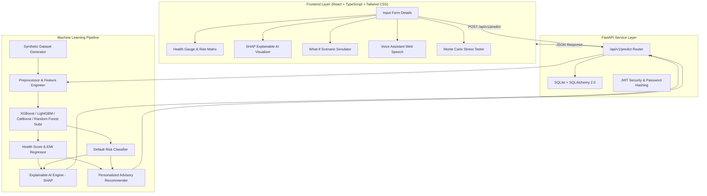

# FinPulse AI - System Architecture & ML Pipeline Specification

```mermaid
graph TD
    subgraph Client ["Frontend Layer (React + TypeScript + Tailwind CSS)"]
        UI[Input Form Details] --> Gauge[Health Gauge & Risk Matrix]
        UI --> XAI_UI[SHAP Explainable AI Visualizer]
        UI --> Sim[What-If Scenario Simulator]
        UI --> Voice[Voice Assistant Web Speech]
        UI --> Stress[Monte Carlo Stress Tester]
    end

    subgraph API ["FastAPI Service Layer"]
        Router["/api/v1/predict Router"]
        DB_Engine[SQLite + SQLAlchemy 2.0]
        Security[JWT Security & Password Hashing]
    end

    subgraph ML ["Machine Learning Pipeline"]
        Gen[Synthetic Dataset Generator] --> Prep[Preprocessor & Feature Engineer]
        Prep --> Models[XGBoost / LightGBM / CatBoost / Random Forest Suite]
        Models --> Reg[Health Score & EMI Regressor]
        Models --> Cls[Default Risk Classifier]
        Reg & Cls --> SHAP[Explainable AI Engine - SHAP]
        Reg & Cls --> Rec[Personalized Advisory Recommender]
    end

    UI -->|POST /api/v1/predict| Router
    Router --> Prep
    SHAP --> Router
    Rec --> Router
    Router -->|JSON Response| Client
    Router --> DB_Engine
```
